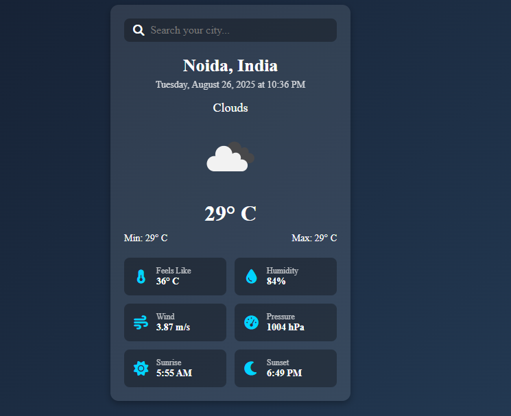

# 🌦️ Weather Application

A simple and responsive **Weather App** built using **HTML, CSS, and JavaScript**.  
It fetches real-time weather data using the **OpenWeatherMap API** and displays temperature, humidity, pressure, wind speed, sunrise & sunset times, and more.

---

## 🚀 Features
- 🌍 Search weather by city name  
- 🕑 Shows current date & time  
- 🌡️ Displays temperature (current, min, max, feels like)  
- 💧 Humidity, 🌬️ Wind speed, and ⏱️ Pressure info  
- 🌅 Sunrise & 🌇 Sunset time display  
- 🎨 Dynamic background changes based on weather (Sunny, Rainy, Cloudy, Night)  
- 📱 Fully responsive design  

---

## 🛠️ Technologies Used
- **HTML5**  
- **CSS3**  
- **JavaScript (ES6)**  
- **[OpenWeatherMap API](https://openweathermap.org/api)**  

---

## 📸 Screenshot


---

## ⚡ Installation & Setup
1. Clone the repository:
   ```bash
   git clone https://jhakhushboo1604.github.io/weather-app/
